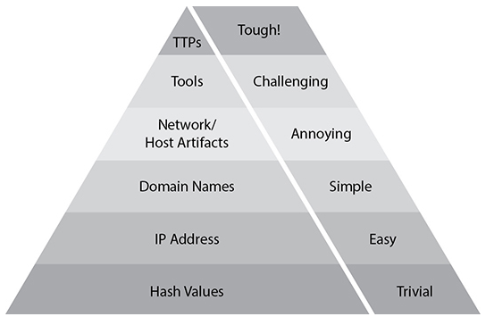

# Threat Intelligence in Support of Organizational Security

## Intro

- alert fatigue = too many false alarms, leading to decrease in responsiveness from incident responders
  - adding more layers of threat intelligence increases context for events and decreases false alarms

## Levels of Intelligence

- security efforts should impair the ability of threat actors to attack or damage the organization
- threat intelligence needs to work to anticipate attacker actions
  - various levels of threat intelligence must exist so as to inform different levels of an organziation's hierarchy to take appropriate actions

| Level | Description |
| ----- | ----------- |
| Strategic | Highest level of intelligence; used to inform organization leaders of key concerns; not overtly technical |
| Operational | Who/when/what are we defending and for how long?  What should be done to achieve strategic goals and what resources do we need? |
| Tactical | Precisely what are the defenders doing in response to actions by attackers; highly actionable level of intel |

## Attack Frameworks 

- frameworks add structure to thought processes and aid in understanding concepts, timelines, and motivations of attackers
  - better understanding of attackers means it is easier for defenders to stop them

### MITRE ATT&CK

- MITRE = federally-funded research organization with cybersecurity specialty
  - created the following systems and frameworks:
    - Cyber Observable eXpression (CybOX)
    - Common Vulnerabilities and Exposures (CVE)
    - Trusted Automated Exchange of Intelligence Information (TAXII)
    - Structured Threat Information Expression (STIX)
- ATT&CK = Adversarial Tactics, Techniques, and Common Knowledge 
  - has 3 flavors:
    1. Enterprise ATT&CK = *SEE BELOW*
    2. PRE-ATT&CK = TTPs used by attackers before launching an attack
    3. Mobile ATT&CK = TTPs used by attackers to get at mobile platforms

#### Enterprise ATT&CK

- most widely used and relevant ATT&CK model
- 12 categories:
  1. Initial Access - how they get into your network/system
  2. Execution - run malicious code on your system
  3. Persistence - maintain presence on your system
  4. Privilege Escalation - gain positions of higher privilege
  5. Defense Evasion - maneuvers used to avoid detection
  6. Credential Access - gathering of names, passwords, tokens
  7. Discovery - increase understanding of network/system
  8. Lateral Movement - pivot and gain access to other systems on network/subsystems
  9. Collection - capture of artifacts
  10. Command and Control - taking control of your system by attackers
  11. Exfiltration - getting your data our of your system by attackers
  12. Impact - what is done by attackers to destroy or damage your system/network
- common language is important for communicating across teams
- hundreds of techniques across categories 
- [MITRE ATT&CK Navigator](https://mitre.github.io/attack-navigator/enterprise/)
  - allows tracking of techniques, tactics, and offenders who commonly utilize them

### The Diamond Model of Intrusion Analysis

- developed by Sergio Caltagirone, Andrew Pendergast, and Christopher Betz to emphasize relationships and characteristics between the following:
  1. Adversary
  2. Capability
  3. Victim
  4. Infrastructure
- model is dynamic, adjusts with adversary actions
- model integrates with 7 axioms which capture the nature of all threats (supposedly):

| Axiom | Conclusion |
| ----- | ---------- |
| Every intrusion is trying to produce a result which furthers the goals of the adversary | Every incident involves the 4 components of the diamond model and can be mapped against them |
| There are adversaries that want to compromise systems for their own benefit | Threat actors are always there; if we know what they want, we can better protect our systems |
| Every system has vulnerabilities and exposures | No technology is purely safe with no exceptions |
| All malicious activity has at least 2 ordered aspects required for successful exploitation | Dependencies must be fulfilled in successful attacks; break the chain, break the attack |
| External resources are needed in every successful attack | Preventing attackers from effectively leveraging these resources will limit the effectiveness of their attempts |
| There is always some kind of prior relationship between victim and attacker | Attacks are becoming more and more difficult to execute, so attackers will only dedicate much time to victims that hold significance to them |
| There is a subset of attackers capable of and motivated in sustaining prolonged malicious efforts against any given victim; these are *persistent adversaries* | Determining which operations require long-term access in order to succeed can help defenders combat them |

### Kill Chain

- phased model which organizes enemy activities in a military operations
- common example is F2T2EA (Find, Fix, Track, Target, Engage, Assess), born from Air Force need for responsive, agile framework to improve air strike response times
- cyber kill chains exist as well to break down attack stages to help defenders pinpoint where in an attack they can develop the most effective countermeasures

#### Lockheed Martin Cyber Kill Chain

- developed in 2011 as whitepaper by security team members
- help defenders build layers of security to thwart attacks at any stage
- loose map, not a definitive blueprint of attack chains
- consists of 7 steps:
  1. Reconnaissance - gather as much information as possible on the target; may be either passive or active
    - defenders need to know what information about their org is available and how it can be leveraged against them
  2. Weaponization - transformation of information gathered in reconnaissance into attacks
    - hard for defenders to intervene because this stage occurs almost entirely on the attacker side
    - best hope is usually to try to extrapolate possible attacks from data that could have been exposed
  3. Delivery - transmission of weaponized attack; phishing emails, MITM attacks, tainted USB injection are examples of delivery mechanisms
    - combination of technical controls and policies help prevent successful attack delivery
  4. Exploitation - leveraging of the delivered payload by the attacker; includes *execution* of payload
    - least privilege and patching known vulnerabilities are often successful at limiting impact
  5. Installation - placement of backdoor or agent to allow persistence for the attacker
    - endpoint detection/monitoring programs help protect against known mechanisms for persistent access
  6. Command and Control (C2) - attacker creates a channel to access system remotely in perpetuity
    - C2 agents have a common traffic pattern which makes it possible to determine when they're present on a network; while they may try to encrypt their way around inspection, defenders who know what's going on within their network should be able to find see this traffic quickly
      - common channels are DNS, HTTP, and email
  7. Actions on Objectives - the reason the defender bought the ticket in the first place: accomplishing their goal
    - data loss prevention software may be successful against some attackers
    - redundant and TESTED backups can help recovery

## Threat Research

- growing field as security frameworks, teams, and practices mature
- ask questions, answer them, rinse and repeat

### Reputational

- malware signatures and IP and domain reputations help defenders filter high risk traffic from their network
  - information is leveraged with firewalls, gateways, intrusion detection systems (IDSs), among others
- reputation of URLs, domains, and IPs can be established with free and commercial services
  - higher scores are associated with higher rates of security incidents
  - Google offers a basic version of this service, notifying users before they access sites that are suspected of being controlled by malicious actors
    - Google subsidiary, VirusTotal, offers reliable results on URLs and file hashes and comes with a nifty API
  - Cisco's Talos team proivdes a reputation center with lookup capabilities

### Behavioral

- just observing what an artifact does rather than trying to reverse engineer it 
- done using isolated environments or sandboxes
  - Cuckoo Sandbox = common open source sandbox tool
  - REMnux = Linux distro for malware reverse engineering
  - may be a pointless exercise if the malware has been engineered to change its behavior when it detects it's in a sandbox

### Indicator of Compromise

- IoC = artifact which shows possibility of attack or compromise; 2 components:
  1. data
  2. context
- Pyramid of Pain (shown below), created by David Bianco to categorize IoCs, the higher in the pyramid defenders attack the IoCs the more difficult it is for attackers to overcome

### Common Vulnerability Scoring System (CVSS)

- framework used to standardize the severity of a given vulerability
- de facto standard (likely to appear on exam)
- 3 metric groups:
  1. base = characteristics that remain constant over time
  2. temporal = characteristics that change with time
  3. environmental = characteristics unique to a user's environment

## Threat Modeling Methodologies

- procedural approach to thinking like the attacker
- create various prototypes of possible attackers and try to find weak points they may exploit
- the goal shapes the approach, some models may seek holistic improvements, others may target very specific points in the system
- threat models should be an input in the earliest stage of SDLC (Systems Development Lifecycle)
  - ensures greater emphasis on potential threats
  - greatest influence on system architecture

### Adversary Capability

- understand what a potential attacker can do to you
- who's attacking, why, how 

### Total Attack Surface

- logical and physical space that can be targeted by attacker
- mapping is an important step towards understanding exposed surface
- analysis of attack surface is done by other security professionals
  - analysts are more concerned about how architecture can be changed to accomodate this

### Attack Vector

- find the most likely path to the jewels
  - done with red teaming, tabletop exercises, visualization
- cut out the paths in as many places as possible

### Impact

- potential damage arising from a single security incident
  - mechanism for communicating risk

### Likelihood

- chance of successful exploitation of a vulnerability

### STRIDE

- threat modeling framework with 6 categories invented in 1999 by Microsoft

| Threat | Property | Definition |
| ------ | -------- | ---------- |
| Spoofing | Authentication | impersonation of an entity |
| Tampering | Integrity | improperly modifying data |
| Repudiation | Nonrepudiation | claiming not to have performed an action nor knowing who did |
| Information Disclosure | Confidentiality | exposing data to unauthorized parties |
| Denial of Service | Availability | denying or degrading service or other resources to legitimate users |
| Elevation of Privilege | Authorization | improperly gaining capabilities |

### PASTA

- Process for Attack Simulation and Threat Analysis (PASTA) = risk-focused threat modeling framework
- aims to align technical requirements with business goals

| Stage | Key Tasks |
| ----- | --------- |
| Define Objectives | identify business objectives and security requirements; perform business impact analysis |
| Define Technical Scope | record infrastructure, application, and software dependencies and technical environment scope |
| Application Decomposition | identify use cases, actors, assets, services, roles, and data sources; create data flow diagrams |
| Threat Analysis | Analyze attack scenarios; perform threat intel correlation, analytics |
| Vulnerability and Weaknesses Analysis | catalog vulnerability reports; map known vulnerabilities; perform design flaw analysis |
| Attack Modeling | analyze complete attack surface |
| Risk and Impact Analysis | qualify and quantify business impact; catalog mitigations; identify residual risk |

## Threat Intelligence Sharing with Supported Functions

### Incident Response

- incident response is a position for more experienced security professionals due to wide breadth of knowledge needed for functions
- speed is a necessity for a successful program
  - playbooks and automated responses are gaining popularity as a result
- repeatable, scalable, reliable processes are the goal

### Vulnerability Management

- every system has vulnerabilities, dilligence is needed to identify these vulnerabilities and patch them
- NIST's National Vulnerability Database (NVD) lists all vulnerabilities known to NIST (though admittedly later than they are known to the general public), in an attempt to make it easy for defenders to know if they have active vulnerabilities in their environments
- threat intelligence adds an operational context to these vulnerabilities, answering whether these vulnerabilities are actively being exploited by attackers
- it's not about what can be exploited, it's about what is likely to be exploited; totally impenetrable security is virtually impossible, so the goal is to prioritize the easiest and likeliest paths to exploitation and block them
- some free sources for intelligence related vulnerabilities are listed below:

| Type | Description |
| ---- | ----------- |
| Information Security Sites | Vendor blogs and disclosres |
| Social media | Twitter is a great location to pick up news on the latest vulnerabilities, exploits, and attack patterns |
| Code repos | GitHub has lots of PoCs |
| Paste sites | Pastebin, Ghostbin, and others often host lists of exploits |

### Risk Management

- risk is understood in terms of impact and probability
- threats are described with the following:
  - capability
  - intent
  - opportunity
- risk management teams try to predict the future
  - threat intelligence is a tool they use to *attempt* to do this
- again, prioritization is the name of the game; here, it's about assets

### Security Engineering

- threat intelligence offers insight into the effectiveness of security implementations within an organization
- TI feedback can be analyzed and acted upon engineers to build better systems

### Detection and Monitoring

- threat intelligence helps teams make better decisions because they have the context needed to understand what's going on outside of their immediate environment that could impact them; this insight helps teams know what to look for on their systems and networks
- it's about seeing the forest for the trees