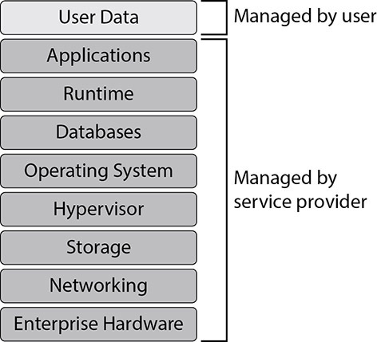
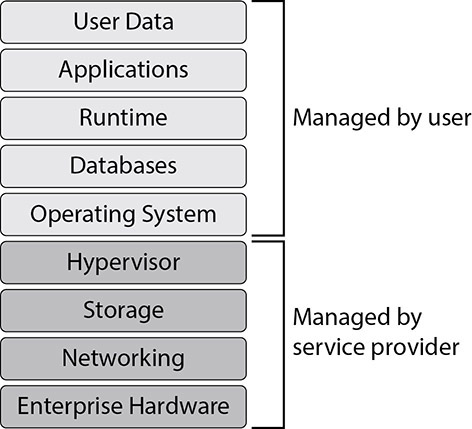

# Threats and Vulnerabilities Associated with Operating in the Cloud

- the cloud needs to be defended just like any other infrastructure
- understanding the threats, vulnerabilities, and responsibilities in the cloud is critical for defenders

## Cloud Service Models

- Software as a Service (SaaS) - vendor manages software, storage, infrastructure
- Platform as a Service (PaaS) - vendor manages platform on which software is deployed to internet
- Infrastructure as a Service (IaaS) - vendor manages hardware only, consumer determines configurations, platform and software

### Shared Responsibility Model

- describes which party is responsible for which aspects of security within the cloud
- different cloud services and CSPs (Cloud Service Providers) offer different levels of security

### Software as a Service

- most common software delivery method
- users are responsible for data protection, vendor covers the rest

- three common types of vulnerabilities which affect SaaS products are the following:
    1. visibility - organizations need to know where their data is going in order to manage it 
    2. management - IAM; who gets to see what data and when
    3. data flow - know where the data goes, once it's out it's gone
- define the boundaries of where data is supposed to and allowed to go

#### Security as a Service (SECaaS)

- security services offered like SaaS cloud model
- similar to MSSPs

### Platform as a Service

- build your own coded application using our environment

- you need to build secure applications and trust that your cloud vendor has good processes in place to protect their areas of responsibility

### Infrastructure as a Service

- a step further down the ladder and closer to the metal in terms of how much the customer controls

- the closer you get to the bottom of the stack, the more control you have and the more vulnerabilities you have to manage yourself

## Cloud Deployment Models

- choose a model that fits your risk appetite, goals, and assets

### Public

- you share infrastructure/computing resources with public organizations (Microsoft, Google, Amazon, etc.)

### Private

- the same organization owns all the infrastructure being used
- common in very big organizations that have sensitive data (government contractors, banks, large manufacturers will often have private clouds to share between internal projects)

### Community

- infrastructure is shared across a select few organizations
- often built for orgs operating in the same environment
	- ex. Azure's Government Community Cloud (GCC)

### Hybrid

- combination of private and public cloud models
- common for banks, who will often have services open to the public and lots of data that they want to control entirely

## Serverless Architecture

