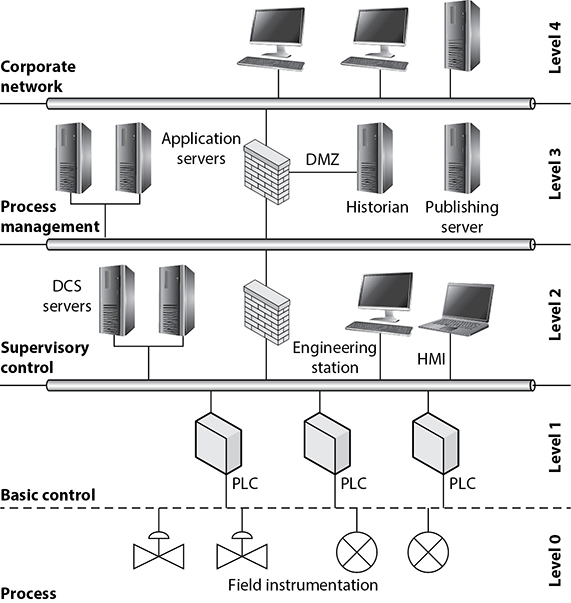

# Threats and Vulnerabilities Associated with Specialized Technology

- attackers look for the easiest path to exploitation
- once all the easy ways in are remediated, the attackers are likely to move on to an easier target (unless there's something very special about your assets)
- common flaws found way too frequently:
    - missing patches/updates
    - misconfigured firewall rules
    - weak passwords

## Access Points

- WAPs are some of the most commonly vulnerable network components
- BYOD policies pose a challenge for security teams
- WEP is insecure and should NEVER be used in a secure network
- rogue WAPs can be connected to a network unless additional protections are implemented
- IEEE 802.1X standard should be implemented
    - client authentication required
    - granular access controls
    - minimum patch/update requirements for connected clients

## Virtual Private Networks

- VPNs connect devices that are on different networks as though they are on the same
- VPN connections are made using several special protocols:
    - Internet Protocol Security (IPSec)
    - Layer 2 Tunneling Protocol (L2TP)
    - Transport Layer Security (TLS)
    - Datagram Transport Layer Security (DTLS) (Cisco devices)
- VPNs can expose corporate networks to dangers by allowing untrusted, unpatched, and infected devices to connect from anywhere
    - we can keep out untrusted connections by requiring a preinstalled certificate on clients
    - we can keep out unpatched connections by implementing Network Access Control to actively check update status of clients before connecting

## Mobile Devices

- given their uniquely privileged access to private data, they are a lucrative target for attackers
- mobile devices are much more susceptible to physical theft than other computing mediums
    - "physical access is total access" - it's much harder to protect data when it's literally in the hands of attackers
- three categories of mobile vulnerabilities:

### Network Vulnerabilities

- 2 network entries:
    - attacks from poorly configured/built mobile networks
    - attacks on the mobile device's mobile interface
- when the network infrastructure itself is exploited, everyone who uses it is vulnerable
    - this is especially problematic when threat actors have government-level control over these networks
- attacks on mobile interfaces are rare, but high impact events

### Device Vulnerabilities

- vulnerabilities to a physical device can be absolutely devastating because the only remediation is to get a new device
    - a really cool example of this is the rowhammer attack
        - this attack is based on how dynamic RAM (DRAM) is accessed in modern computers where a small electrical signal changes leaks to nearby cells in memory whenever a certain cell is accessed.  In theory, this can be leveraged into privilege escalation by creating a large enough electrical charge to change specific memory addresses.  Realistically, it's basically impossible in any practical setting, but it does show that virtually all hardware is susceptible to attack

### Operating System Vulnerabilities 

- developers aim to limit time between patch release and installation; attackers want the reverse so they maximize the time that an exploit is viable
    - window of vulnerability = time between vulnerability discovery and patch installation
- Android devices tend to have larger windows of vulnerability because of the need to coordinate across multiple vendors
    - iOS doesn't have this problem because of its centralization

### App Vulnerabilities

- quick software development cycles tend to cause more vulnerabilities
- later sections will cover this more deeply

### Improper Platform Usage

- it is not unusual for developers to take shortcuts in app development that cause vulnerabilities
- when developers make mistakes, whether from misunderstanding or laziness, it can lead to vulnerabilities

### Insecure Data Storage

- privacy and security are risked when data is not handled carefully
- data at rest and in motion must be protected; common problems include:
    - world readable files
    - improper logging
    - secretly generated analytics

### Insecure Authentication

- local authentication means locally stored passwords
    - when passwords are stored locally, they are outside of the control (and protection) of an app/platform/software developer
- insufficient password policies increase the likelihood of exploitation

### Insecure Authorization

- inaccurate permissions for resources to which any user or role should have access
- order of authentication is also important- if an API call can be completed before authentication, it's also an authorization issue

### Code Quality Vulnerabilities

- code reuse means potentially reusing old mistakes and vulnerabilities
- increased dependence on third party libraries means that attackers just need to poison one pool to affect many apps
- code review with SMEs is an effective step to ensure code quality
- code should not be able to run if it has been manipulated after deployment
    - prevents injections

#### Messaging Platforms

- example of RCE from WhatsApp 2019
- app vulnerability could be leveraged to attack the entire device

## Internet of Things

- IoT devices are generally non-traditional computing devices; in enterprise settings, they (theoretically) make processes more efficient
- common enterprise IoT devices include:
    - CCTV cameras
    - smart thermostats and lighting devices
    - printers
- provide visibility into status of assets, but also increase attack surface
- patches are tough to install on these devices, but are still important for security
- default passwords should be changed before the devices are put into use

### The Mirai Botnet

- botnet that targets IoT devices for DDoS attacks
- in 2016 it took down a bunch of popular websites
- creating strong passwords and closing unused ports are really effective protections

### Medical Devices

- PoCs have been developed to act on medical IoT devices, but none have been found in the wild
- despite the fact that none have been exploited, they should still be strongly protected

## Embedded Systems

- these systems are run by firmware or hardwired instructions
- since the code that they run is so deeply engrained in them, it is very hard to remediate vulnerabilities and monitor their activity centrally

### Real-Time Operating Systems

- a RTOS is used for low-latency output for input
- used in vehicles, manufacturing equipment, aircraft
- used heavily for optimizing task scheduling

### System on a Chip

- combination of software and hardware in a single integrated circuit and processor
- hardware verifications must be performed as well as software verfications
    - hardware and software are tightly coupled

### Field Programmable Gate Array

- programmable chips for a variety of specialized functions
- processes are defined using hardware description language (HDL) which may be a target for attack

## Physical Access Control

- combination of hardware and logical artifacts to authenticate a user based on credentials
- RFID badges and card readers are very common for this
- when physical access is controlled by only one protection, it is usually possible to overcome
    - if a door is controlled by a badging scheme, the badge may be forged, the reader may be hacked, or, depending on implementation, the attacker may simply remove the reader and open the door by immitating the electical pulse sent by the reader to signify a successful read
- spoofing by replay or cloning is a common attack
    - replays are done by repeating an authentic packet or communication to receive the same access
    - cloning is done by copying some information or artifact to emulate its functionality

## Connected Vehicles

- connected vehicles add new vulnerabilities besides the traditional hardware problems
- detection and remediation is very difficult

### CAN Bus

- CAN Bus = controller area network; defines control of systems by vehicle components usually with ECUs (electronic control units)
- has no ingrained security
- highly susceptible to MITM attacks

### Drones

- remote control of drones is susceptible to attack
- drones can be used for cheap surveillance or denial of service attacks on physical aviation

#### Hardware Security

- hardware components for drones can be easily swapped out with those from an attacker
- secure storage is important for preventing attacks on hardware

#### Communications Channels Security

- drones that communicate over networks have the same vulnerabilities as those networks
- direct and encrypted communication can help prevent this

#### Web Portal Security

- the portals used to take control of drones via a web app are also a potential attack vector

## Industrial Control Systems

- cyber systems which control physical behaviors

- heavily reliant on firmware
- updates and patches are super difficult to deploy, they typically cannot be centralized or automated and require downtime
- default passwords are difficult to change and are publicized by the vendor

### Vulnerabilities in Interconnected Networks

- every endpoint on a network is a potential entry point for attackers, limit your endpoints and segment your networks

## SCADA Devices

- SCADA = Supervisory Control and Data Acquisition system; type of ICS used for controlling and monitoring widely distributed (by area) devices 
- used for transmissions and pipelines
- historically reliant on obscurity for security
- reliance on remote stations for transmissions

### Modbus

- prioritizes functionality over security in communications 
- de facto standard for communicating between PLCs
- easy to intercept, replay, and forge packets

## Process Automation Systems

- PAS = workflow automation system (WAS); automate day-to-day business processes
- when complex processes or those with edge cases are automated, the possibility for exploitation is high
